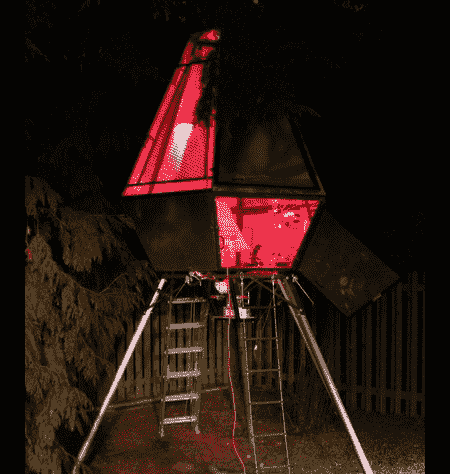

# 惊人的后院火箭船树屋

> 原文：<https://hackaday.com/2011/02/21/amazing-backyard-rocket-ship-tree-house/>

如果你认为你小时候有一个很酷的树屋，再想想吧。任务是美化他的后院并为他的儿子建造一个树屋，[乔恩]决定全力以赴，为他建造一艘火箭船。

这座被称为 Ravenna 超低空飞行器(RULAV)的树屋高 15 英尺，矗立在西雅图的地平线上，肯定会成为附近每个孩子羡慕的对象。[乔恩]和一个朋友在他们的创作上工作了一年多，焊接，研磨，绘画，铆接。结构建成后，他们制造了一些定制的印刷电路板，用它们来建造船上的 14 个控制面板。整个操作由定制操作系统控制，该操作系统运行在三个管理操作的 ATmega MCUs 上。

这艘船不满足于仅有的几个旋钮和开关，在其电子产品清单中包含了 800 多个 led。压缩空气被用来从定位“推进器”射出水，而一个颜料混合器在船下旋转，以模拟太空旅行的粗糙和颠簸。模拟发射以大量真实的 NASA 风格的音频和亚低音扬声器结束，使一切产生深刻的共鸣。

这个项目真的很棒，为了建造这个有史以来最壮观的树屋，我们在每一个细节上都做了大量的工作。[Jon]肯定会因为这个造型获得“史上最酷爸爸”奖，即使我们都很嫉妒！

图片当然没有做到公正，所以一定要看看下面的视频，快速介绍和演示这个可怕的项目。

感谢[Jeremy Elson]的提示。

 <https://www.youtube.com/embed/8izMrzulMHI?version=3&rel=1&showsearch=0&showinfo=1&iv_load_policy=1&fs=1&hl=en-US&autohide=2&wmode=transparent>

 </body> </html>