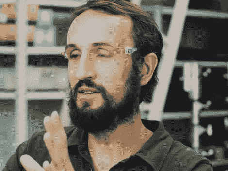

# 眼睑快门眼镜:假的，但仍然是一个黑客

> 原文：<https://hackaday.com/2011/02/22/eyelid-shutter-glasses-fake-but-still-a-hack/>

如果你一直关注我们今年的专题报道，你会记得关于[用自己的眼睑做 3D 快门眼镜](http://hackaday.com/2011/01/16/electrodes-turn-your-eyelids-into-3d-shutter-glasses/)的帖子。大量的评论称这个是假的，他们是对的。但是我们仍然很享受这种体验…当这些巨魔很有技巧并且想法很有创意的时候，被巨魔攻击会更有趣。行凶者[发布了一段后续视频](http://www.youtube.com/watch?v=Q3VoVjAF0h8)，展示了他们是如何做到的。不仅仅是一个电子小饰品和一些演技。后期制作执行得很好，绘制出了这位先生眼睛周围的区域，并编辑了有节奏的眨眼，使这场闹剧有点可信。休息之后来看看。

如何做到的:

 <https://www.youtube.com/embed/Q3VoVjAF0h8?version=3&rel=1&showsearch=0&showinfo=1&iv_load_policy=1&fs=1&hl=en-US&autohide=2&wmode=transparent>

 
原视频:
 <iframe class="youtube-player" width="800" height="480" src="https://www.youtube.com/embed/Uef17zOCDb8?version=3&amp;rel=1&amp;showsearch=0&amp;showinfo=1&amp;iv_load_policy=1&amp;fs=1&amp;hl=en-US&amp;autohide=2&amp;wmode=transparent" allowfullscreen="true" style="border:0;" sandbox="allow-scripts allow-same-origin allow-popups allow-presentation"/> 
[谢谢 unaB]
 </body> </html>