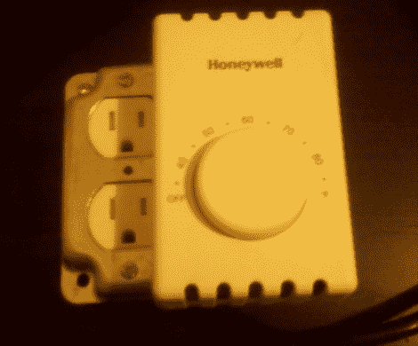

# 恒温器控制的插头盒

> 原文：<https://hackaday.com/2011/02/22/thermostat-controlled-plug-box/>

[Eric]他的新房子有问题，被改造成阁楼的阁楼空间没有暖气。面对无法接入管道系统，想把空间用作卧室的情况，他做了我们大多数人会做的事情，只是得到了一个小空间加热器。任何与空间加热器一起生活过的人都知道，你必须在附近才能打开它们，而且它们通常没有像样的温度控制。这些问题通过制作一个[恒温器控制的插头盒](http://thetechnickel.com/projects/thermostat-box.html)很快得到解决。

去五金店看了一下，发现了一个双金属接线盒、带 GFCI 断流器的面板、插座和一个霍尼韦尔护壁板加热器恒温器。然后恒温器连接到电源，其输出连接到插座。

他给出了关于他的部件的接线说明，但是你应该按照你的特定恒温器的说明，如果用电源电流工作，就要小心。故事的结尾是一个温度更加恒定的卧室，不需要燃烧 3 个小时就可以到达那里。