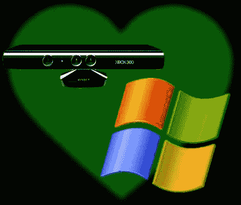

# Kinect 将在开源驱动开发数月后获得 Windows 驱动

> 原文：<https://hackaday.com/2011/02/22/kinect-to-get-windows-drivers-months-after-open-source-drivers-were-developed/>

微软计划在今年春天发布 Kinect 的 Windows 驱动程序，几个月前，一个积极的黑客社区开发了开源驱动程序[。硬件开发时与微软团队一起工作的约翰尼·李中提到，他曾推动微软开发并发布至少基本的 Windows 驱动程序。这一拒绝让他成为 Adafruit 开放 Kinect 竞赛的顶级啦啦队员和奖金贡献者，该竞赛导致(我们可能会很快添加)开源驱动程序的可用性。如果你在过去三个月里一直关注 Hackaday 或任何其他科技博客，你就会知道](http://hackaday.com/2010/11/04/kilobuck-open-kinect-project-prize/)[使用 Kinect](http://hackaday.com/2011/01/19/projector-tricks-make-use-of-kinect-3d-mapping/) 的[项目的爆炸](http://hackaday.com/2011/01/06/drill-based-kinect-camera/)随之而来，并且【约翰尼】认为微软发布 Windows 驱动程序的决定是试图在他们自己的旗舰操作系统上驾驭这股浪潮，而不是继续作为旁观者。