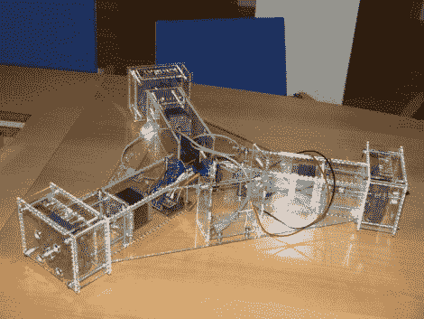

# KiwiDrive HouseBot

> 原文：<https://hackaday.com/2011/02/22/kiwidrive-housebot/>

瑞典黑客空间 Forskningsavdelningen 上周末举办了一场黑客马拉松，KiwiDrive HouseBot 是该团队努力的成果之一。他们设定了一个目标，使用标准的、容易获得的部件，这样机器人平台就可以被个人或其他黑客空间复制。这种三条腿的设备在三个全方位轮子上滚动——这可能是最难获得的部分，但是[你可以随时打印自己的](http://hackaday.com/2010/04/28/printable-mecanum%c2%a0wheel/)。Arduino Uno 被用作硬件接口，驱动三个步进电机移动。

上图中没有，但第四代小家伙还包括一个网络摄像头。摄像机位于机身中央，安装在伺服系统上。这使得转动相机成为可能，意味着这种设计没有真正的正面或背面。未来的计划包括添加一台车载计算机(这比看起来要大)，并在 8×8 LED 矩阵上实现表情符号，想必这样你就可以知道机器人今天的感受了。

[谢谢凯维瑞]