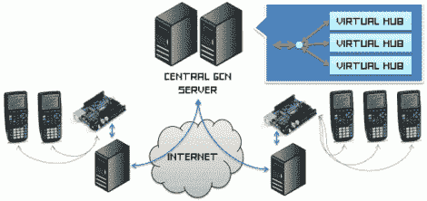

# 环球计算网:您的 TI-83 刚刚接入互联网

> 原文：<https://hackaday.com/2011/02/22/global-calcnet-your-ti-83-just-acquired-internet/>

Global CALCnet 允许您将 TI 图形计算器连接到互联网，并使用您喜欢的服务，如即时消息和互联网中继聊天。它还为移植到设备上的游戏(如焦土和俄罗斯方块)提供了全球多人游戏功能。去年 12 月，我们参观了[克里斯托弗·米切尔的] CALCnet，当时它正被用来通过加法机创建局域网。在 Arduino 的帮助下，他将这一点提升了一个档次。Arduino 板用于通过 Arduino 的 USB 功能将计算器的串行通信连接到互联网连接的 PC。

觉得这样会在学校浪费很多时间？不太可能，因为连接互联网的计算机是这个系统工作不可或缺的。如果你面前有一台电脑，为什么要在计算机网络上浪费时间呢？然而，建立一个可以直接将他们连接到接入点的 WiFi 模块会有多难呢？这可能是一个有争议的问题，因为 Slashdot 的文章将我们引向了 global CALCnet，也链接到了[一个计算器末日的港口](http://www.omnimaga.org/index.php?topic=6609.0)。它运行得相当好，你可以在休息后的视频中看到。这是任何拥有可以运行它的 TI Nspire 的人的必备工具。

 <https://www.youtube.com/embed/NsN2JIRGHAo?version=3&rel=1&showsearch=0&showinfo=1&iv_load_policy=1&fs=1&hl=en-US&autohide=2&wmode=transparent>

 
[谢谢 Rlyeh_Drifter]
 </body> </html>