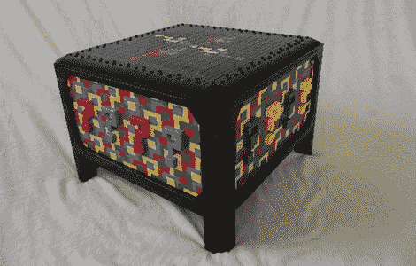

# 乐高神秘盒子

> 原文：<https://hackaday.com/2011/02/23/mystery-box-out-of-lego/>

[Todd]最近完成了他最大的乐高项目，非常疯狂。[神秘盒子](http://www.mocpages.com/moc.php/249968)是一个 8 格乐高积木拼图盒，上面覆盖着一个相互连接的问号的迷幻图案。

问号图案的灵感来自几件事，名为“夜间狗的奇怪事件”的书包含了一幅看起来有点像 mark 埃舍尔画作的插图，环顾四周，带来了[镶嵌](http://en.wikipedia.org/wiki/Tessellation)。考虑到这一点，[托德]坐下来用一个绘画程序，画出一个网格，并开始填充方块，直到图案完美。

在传统的谜题盒子中，要获得里面的东西，你必须按照特定的神秘顺序移除每个隔间，而要做到这一点并不容易。[乐高数字设计师](http://ldd.lego.com/)被用来制作盒子上所有东西的原型，然后一旦高兴，[托德]就把模型拆开，进行零件计数。

近 8000 个零件，35 个砖块订单，以及一些漫长的等待，盒子终于完成了，它绝对值得一看。如果你没有那么极端，他们也制造很酷的电子外壳。