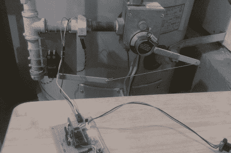

# 自动调节热水器

> 原文：<https://hackaday.com/2011/02/23/self-regulating-water-heater/>

如今，大多数人都希望生活得更环保一点，激励因素通常是环境保护或财务考虑。杨奇煜属于后一类人，他意识到他每月大约 25%的煤气费都用来加热他和家人每天使用的水了。经过一些计算，他发现他们只需要热水器每周运行 168 小时中的 68 小时的热水。他认为节省几美元的最好方法是安装热水器，让它在不用的时候自动关闭。

他在热水器的温度控制旋钮上连接了一个伺服系统，允许通过微控制器进行调节。有了一个关于他的家人平均一周的日程安排的粗略想法，他为他的 Netduino 编写了一个应用程序，在需要时启动伺服系统。一个 DS1307 实时时钟被连接到 Netduino 以获得准确的计时，从而确保[杨奇煜的]妻子永远不必忍受冷水淋浴。

令人遗憾的是，大多数热水器没有像你在较新的 HVAC 系统中看到的那样配备某种可编程恒温器，但这个黑客绝对是朝着正确方向迈出的一步。

继续阅读，看看他的节能热水器在行动。

[https://www.youtube.com/embed/QEmMS5qdOcI?version=3&rel=1&showsearch=0&showinfo=1&iv_load_policy=1&fs=1&hl=en-US&autohide=2&wmode=transparent](https://www.youtube.com/embed/QEmMS5qdOcI?version=3&rel=1&showsearch=0&showinfo=1&iv_load_policy=1&fs=1&hl=en-US&autohide=2&wmode=transparent)

[https://www.youtube.com/embed/ntumJIyvUzw?version=3&rel=1&showsearch=0&showinfo=1&iv_load_policy=1&fs=1&hl=en-US&autohide=2&wmode=transparent](https://www.youtube.com/embed/ntumJIyvUzw?version=3&rel=1&showsearch=0&showinfo=1&iv_load_policy=1&fs=1&hl=en-US&autohide=2&wmode=transparent)