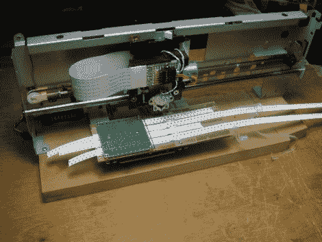

# 磁性 SMD 拾取和放置

> 原文：<https://hackaday.com/2011/02/24/magnetic-smd-pick-and-place/>

[斯沃夫斯基]给我们发来了他找到的这个取放机器人([谷歌翻译](http://translate.google.com/translate?hl=en&sl=ru&tl=en&u=http%3A%2F%2Fwww.marsohod.org%2Findex.php%2Fprojects%2F138-cloning))，它相当独特。组成这种拾放设备的大部分组件都是从旧计算机设备中回收的。X 轴运动是使用旧的打印机部件完成的，而旧的 CD-ROM 驱动器被挖空以提供沿 Y 轴的运动。最终选择软驱组件来提供抓放 Z 轴运动。

然而，使这种拾取和放置独特的是元件移动的方式。我们见过的[的大多数](http://hackaday.com/2011/02/08/update-open-source-pick-and-place/)[拾取和放置设备](http://hackaday.com/2011/02/21/diy-pick-and-place-seems-easy-to-build/)依靠吸力来提升和搬运元件，但这个使用磁铁代替。该机器用于为制造商网站上提供的机器人平台制造小型电路板，该平台主要利用 SMD 部件。一旦他们意识到他们的大部分小部件是铁磁性的，他们就制造了一个手绕电磁铁来提升它们。虽然该设计将该设备的使用限制在严格的铁磁部件上，但它们有非常特殊的需求，这可以完美地满足这些需求。

这种拾取和放置的另一个独特方面是位于工件下方的开槽工作台。它用于传送多达四个 SMD 元件卷轴，贴装头提供所有卷轴运动，而不是依靠单独的电机。

如果您有几分钟时间，请务必[看看工作中的取放视频](http://www.marsohod.oimg/stories/videos/set-comp.flv)。