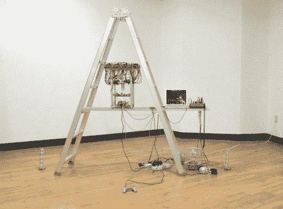

# 机器在世界任何地方按下手机按钮

> 原文：<https://hackaday.com/2011/02/24/machine-pushes-cellphone-buttons-from-anywhere-in-the-world/>

【莫扬 Bacq】周末工作，做手机游戏监控服务。他有三部手机用于工作，虽然你可能认为这意味着他可以在世界任何地方工作，但漫游费是一个杀手。他的解决方案是建造一台极其复杂的机器，可以代表他使用三部不同的手机。

上面你可以看到它栖息在梯子顶端的下面，但是休息后你肯定会想看这个视频的。这种接口方法使用一个摄像头来查看每部手机。它朝下挂着，像钟摆一样移动，每次只看三个屏幕中的一个。每部手机的每个按钮都有一个伺服电机，它使用一根柔性电缆作为执行器。现在，他可以出国旅行，只需通过互联网登记他的两个 17 小时的周末轮班(上午 10 点到第二天凌晨 3 点)工作电话。

这让我们想起了[手机续航测试](http://hackaday.com/2011/01/01/cell-phone-endurance-tests/)。按钮停止工作时会发生什么？

<https://player.vimeo.com/video/12109563>

 </body> </html>