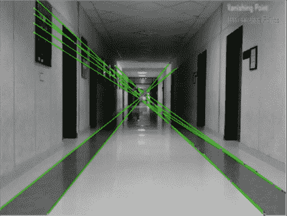

# 消失点机器人导航

> 原文：<https://hackaday.com/2011/02/24/vanishing-point-robot-guidance/>

巴基斯坦国家计算机和新兴科学大学的学生一直在研究一种机器人来帮助视力受损的人。它看起来很简单，只是一个携带笔记本电脑和网络摄像头的移动底座。这个机器人没有环境地图，而是使用消失点导航。正如你在上面的图像中所看到的，每一个被捕获的帧都被分析来寻找透视的指示器，这些指示器可以一直外推至上面绿线相交的消失点。在这里，它利用地板上的条纹，以及墙壁与天花板相接的角落来建立这些线条。从休息后的视频中，你可以看到这种方法是可行的，也许通过一点点平均，他们可以让机器人直线行驶，减少曲折。

明尼苏达大学正在进行消失点导航的类似工作。[Pratap R. Tokekar 的]机器人也可以在休息后看到，沿着走廊快速移动，甚至在跑出走廊时转弯。

NUCES 巴基斯坦视障导游机器人:

[https://www.youtube.com/embed/Z2H9LhJ46Hw?version=3&rel=1&showsearch=0&showinfo=1&iv_load_policy=1&fs=1&hl=en-US&autohide=2&wmode=transparent](https://www.youtube.com/embed/Z2H9LhJ46Hw?version=3&rel=1&showsearch=0&showinfo=1&iv_load_policy=1&fs=1&hl=en-US&autohide=2&wmode=transparent)

明尼苏达大学提供:

[https://www.youtube.com/embed/nb0VpSYtJ_Y?version=3&rel=1&showsearch=0&showinfo=1&iv_load_policy=1&fs=1&hl=en-US&autohide=2&wmode=transparent](https://www.youtube.com/embed/nb0VpSYtJ_Y?version=3&rel=1&showsearch=0&showinfo=1&iv_load_policy=1&fs=1&hl=en-US&autohide=2&wmode=transparent)