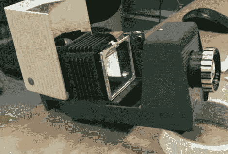

# 视频投影机从一个旧的单幻灯片单位

> 原文：<https://hackaday.com/2011/02/24/video-projector-from-an-old-single-slide-unit/>

这是[Matt]一起组装的视频投影仪。他需要一种小型且廉价的解决方案，以用于他在 R2D2 的构建。在休息后的视频中可以看到，它回放公主的求救电话没有任何问题。但即使 R2D2 不是你要找的机器人之一，我们认为这在其他方面也是有用的。想到的一个用途是用于[基于投影仪的万圣节展示](http://hackaday.com/2011/01/10/halloween-hangover-talking-heads/)。

就像过去的投影仪黑客一样，你真正需要的是一个光源，一个可以播放视频的 LCD 屏幕，以及一个将光线聚焦到屏幕上的镜头。通常，LCD 是项目中最昂贵的部分，按照正确的尺寸建造外壳可能有点困难。[Matt]的解决方案是使用 MP4 山寨媒体播放器。其余的设置是一个 50 年代的幻灯机。媒体播放器的屏幕大约与单张电影幻灯片一样大，所以他将屏幕从盒子中取出，放在幻灯片所在的位置。

 <https://www.youtube.com/embed/seKHgC4qkDY?version=3&rel=1&showsearch=0&showinfo=1&iv_load_policy=1&fs=1&hl=en-US&autohide=2&wmode=transparent>

 </body> </html>