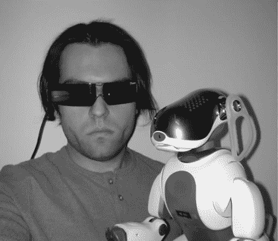

# 看看索尼正在进行的对抗黑客的战争

> 原文：<https://hackaday.com/2011/02/25/a-look-at-sonys-ongoing-war-against-hackers/>

[Phillip Torrone]最近在 Make 上写了一篇关于索尼和他们对制造商、黑客和创新者的[战争](http://blog.makezine.com/archive/2011/02/sonys-war-on-makers-hackers-and-innovators.html)的文章。在这篇文章中，他追溯了索尼作为一家广受欢迎的硬件公司的历史，这家公司曾经生产创新产品，现在却成为所有敢于挥舞螺丝刀和烙铁的人的敌人。他花了相当多的时间在互联网上搜索，挖掘索尼对黑客社区的攻击的非常具体的例子。这并不是说，他只是简单地痛斥了这家公司，然后就此作罢。相反，他反思了他们作为几乎每个美国家庭的主食的过去，他们自从涉足内容业务以来发生了怎样的变化，以及我们作为黑客能够做些什么来改变索尼对待客户的方式。

他提到的一个具体例子是困扰索尼艾博改装现场的诉讼，这是一个非常接近他的心的案件。在这种情况下，人们的声音最终被听到，尽管为时已晚，无法有所作为。他哀叹道，改装社区对这个平台失去了兴趣，这是索尼好打官司的灾难性的明显例子。

如果你有时间的话，一定要花点时间来阅读这篇文章。[Phillip]提出了一些非常好的观点，让您下次购买电子产品时，无论是大是小，都有足够的时间考虑。

我们也很想听听你对此事的看法。