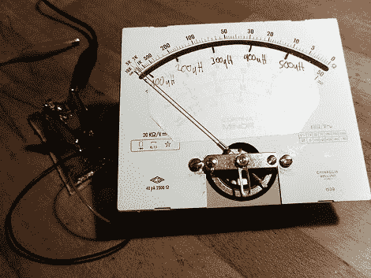

# 555 电感计

> 原文：<https://hackaday.com/2011/02/25/555-inductance-meter/>

[Apexys]正在用开关模式电源进行一些实验，需要比较他使用的线圈的电感。他的万用表没有电感测试功能，但是他手头有一个 555 定时器。他把 [555 和其他一些零件组装在一起，创造了自己的 L 米](http://apexys-toan.blogspot.com/2011/02/ne555-based-inductivty-meter.html)。文章包括电表背后的理论，输入交流电源通过 RC 网络转换成电压。

一旦他完成了设计，就该建造电路了。他发明了一种他称之为 DCB 的东西，而不是印刷电路板；拉制电路板。我们不得不承认，这比使用墨粉转移或点对点焊接要快得多。我们也喜欢他使用锥形瓶和火炬来加热蚀刻剂。我们在冬天不生产多氯联苯，因为我们的氯化铜在室外太冷了，但现在可能会改变。拼图的最后一块是一个模拟电表，他从手头的一个额外微安电表中取出来的。休息后请欣赏演示。

[https://www.youtube.com/embed/PxVmkd5yD6Q?version=3&rel=1&showsearch=0&showinfo=1&iv_load_policy=1&fs=1&hl=en-US&autohide=2&wmode=transparent](https://www.youtube.com/embed/PxVmkd5yD6Q?version=3&rel=1&showsearch=0&showinfo=1&iv_load_policy=1&fs=1&hl=en-US&autohide=2&wmode=transparent)