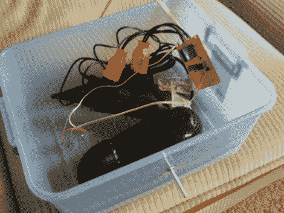

# DIY 热风干手器——强迫症患者最好的朋友

> 原文：<https://hackaday.com/2011/02/25/diy-hot-air-hand-dryer-an-ocd-sufferers-best-friend/>

[haqnmaq]承认他患有强迫症，有时会被发现每小时洗手 20 次。他非常不信任布毛巾，只用纸巾擦手，一天要擦 2-3 卷。为了减少他的强迫症对环境和钱包的影响，他决定用 555 定时器建造一个自动热风干手器，这也是他参加 T2 555 设计竞赛的参赛作品。

他的项目背后的概念是使用吹风机作为热空气源，依靠光电晶体管和一对红外发光二极管来检测手何时放在吹风机下面。当检测到一双手时，继电器被触发，吹风机被打开。一旦吹风机已经运行了预定的但可调节的时间，继电器打开，吹风机关闭。

这是一个非常简单的项目，但是非常有用，不管你是否患有强迫症。他可能要注意的唯一一件事是进入烘干机的气流受限，因为烘干机安装在一个密封的塑料容器中——用孔锯几秒钟就可以很容易地解决这个问题。

想看看干手器的运行吗？继续阅读一个简短的视频演示。

[谢谢瑞安]

 <https://www.youtube.com/embed/trS-5hMhjzE?version=3&rel=1&showsearch=0&showinfo=1&iv_load_policy=1&fs=1&hl=en-US&autohide=2&wmode=transparent>

 </body> </html>