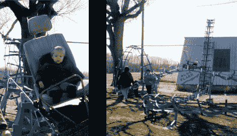

# 把你孩子的生活托付给自制的过山车？

> 原文：<https://hackaday.com/2011/02/26/entrust-you-kids-life-to-a-homemade-roller-coaster/>

所以你认为自己是个业余工程师？学习焊接技术有一段时间了吗？真正的考验是在[你设计并建造的](http://www.negative-g.com/BlueFlash/February2002/Blue-Flash-2002-2-1.html) ( [翻译](http://translate.google.com/translate?js=n&prev=_t&hl=en&ie=UTF-8&layout=2&eotf=1&sl=auto&tl=en&u=http://anub.ru/23.02.2011/samodelnie_amerikanskie_gorki/))过山车上信任你孩子的生命。

现在我们不是在谈论像茶杯一样的老掉牙的嘉年华。这是一个完整的过山车，有一个上下颠倒的循环。游乐设施从一个链条升降机到车库/谷仓屋顶开始。从那里开始，它就在单人列车上出发了。我们建议把你的手和脚放在车里…如果有车的话。乘坐利用汽车座椅，但你将不得不满足于安全腰带，因为这里没有肩部约束。我们对轨道底座有点担心——我们敢打赌它们没有很好地固定在地面上——但整个轨道都被油漆过的事实让我们认为[约翰·伊弗斯]可能至少知道一点他在做什么。别忘了看折叠下面的视频。

**更新:**感谢评论中的[Tom 101]链接，休息后现在嵌入了更好的视频。

**更新:**来源链接更改为原文感谢【Mike 的】评论。

制作精良的杯垫概述:

[https://www.youtube.com/embed/U7gDYObipjg?version=3&rel=1&showsearch=0&showinfo=1&iv_load_policy=1&fs=1&hl=en-US&autohide=2&wmode=transparent](https://www.youtube.com/embed/U7gDYObipjg?version=3&rel=1&showsearch=0&showinfo=1&iv_load_policy=1&fs=1&hl=en-US&autohide=2&wmode=transparent)

快速和肮脏的演示:

[https://www.youtube.com/embed/Cj7bKOUpBII?version=3&rel=1&showsearch=0&showinfo=1&iv_load_policy=1&fs=1&hl=en-US&autohide=2&wmode=transparent](https://www.youtube.com/embed/Cj7bKOUpBII?version=3&rel=1&showsearch=0&showinfo=1&iv_load_policy=1&fs=1&hl=en-US&autohide=2&wmode=transparent)

[谢谢安德鲁]