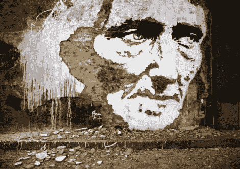

# 炸药爆炸了——用精密炸药制作的壁画

> 原文：<https://hackaday.com/2011/02/26/boom-goes-the-dynamite-murals-made-with-precision-explosives/>

[亚历山大·法托]以一些非传统的艺术展览而闻名，但他的最新作品却是字面上的意思。他利用精确放置的炸药，在伦敦各地的墙上雕刻肖像和其他壁画。

他能够制作这些图像的细节是令人难以置信的，考虑到他是从墙上吹下大块的石膏和砖块来形成它们的。我们只能猜测完成这些图像中的一个需要多少准备时间，更不用说收集他整理的令人惊叹的作品集了。

他最近还与音乐艺术家[Orelha Negra]合作，制作了一个很酷的视频，展示了他正在雕刻的作品，这当然值得花三分钟来观看。嵌入下面的视频充满了拆除/雕刻过程的慢动作镜头。

如果你有几分钟时间，一定要去他的网站看看他的一些作品，我们认为你会印象深刻。

[https://www.youtube.com/embed/t6FU1Fvn9Nk?version=3&rel=1&showsearch=0&showinfo=1&iv_load_policy=1&fs=1&hl=en-US&autohide=2&wmode=transparent](https://www.youtube.com/embed/t6FU1Fvn9Nk?version=3&rel=1&showsearch=0&showinfo=1&iv_load_policy=1&fs=1&hl=en-US&autohide=2&wmode=transparent)