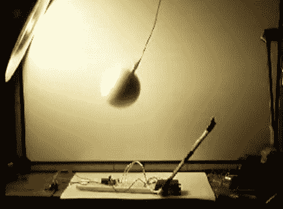

# 模拟机器人概念

> 原文：<https://hackaday.com/2011/02/26/analog-robotic-concepts/>

每个人都加入了 555 计时器项目。但是[汤姆]不仅仅提出了一个项目，他还分享了许多与模拟机器人相关的想法。它们以伺服电机控制为中心。你可以在休息后的视频中看到，他以一种令人愉快的方式分享了许多细节，同时也制作了一个易于观看的演示视频。他会贴一个大概一秒钟的示意图，然后继续前进，通过不唠叨来拯救那些不关心细节的人。

第一个闪过的原理图是控制伺服电机的主电路。其余的概念建立在这个电路上，使用光、声、柔性和其它传感器作为输入。例如，上面的设置使用了光传感器。当球挡住光线时，伺服系统会移动垂直杆，使其避开光线。当它向后摆动时，这个过程重复进行。令人惊讶的是，这些反应如此逼真，让我们想起了昆虫的运动。但这只是冰山一角，因为他有很多未来视频的想法，我们迫不及待地想看到。

 <https://www.youtube.com/embed/uXeSsevsNNE?version=3&rel=1&showsearch=0&showinfo=1&iv_load_policy=1&fs=1&hl=en-US&autohide=2&wmode=transparent>

 
[谢谢杰里]
 </body> </html>