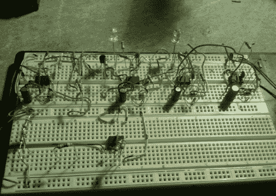

# AM/FM SOS 信标拯救你的培根

> 原文：<https://hackaday.com/2011/02/27/amfm-sos-beacon-saves-your-bacon/>

[BadWolf]发给我们一个叫做“[培根灯塔](http://badwolf.hackhut.com/2011/02/20/555-contest-entries-badwolf/)的装置，这是他的 [555 设计大赛](http://hackaday.com/2011/01/25/555-design-contest-win-1500-in-prizes/)参赛作品。简而言之，这是一种救生设备，可以在 AM 和 FM 波段发射莫尔斯电码的求救信号。该设备使用五个 555 定时器来完成工作，每个定时器都专用于一个特定的任务。其中三个计时器用于计时和产生莫尔斯信号，而剩下的两个用于产生和通过无线电波传输声音信号。目前，信号可以在距离信号源大约一英里的地方被接收到，这在理论上允许搜救队用简单的无线电和定向天线来定位你。

目前的设计仍然有点粗糙，但最终的计划是将电路内置于一个类似手电筒的设备中，配备红色和绿色的信号 led。这是一个聪明的项目，如果你在徒步旅行中迷路了，或者遇到僵尸末日，它会成为一个很好的工具。

如果你想知道为什么 BadWolf 的项目有这样一个奇怪的名字(提示:这并不是因为它可以“拯救你的培根”)，请留下来观看培根灯塔的快速视频。

 <https://www.youtube.com/embed/zs1IMPv_wT4?version=3&rel=1&showsearch=0&showinfo=1&iv_load_policy=1&fs=1&hl=en-US&autohide=2&wmode=transparent>

 </body> </html>