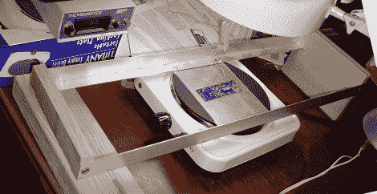

# 易于建造的钻机防止回流焊接事故

> 原文：<https://hackaday.com/2011/02/27/easy-to-build-rig-prevents-reflow-soldering-mishaps/>

[Erich aka VK5HSE]执行了相当多的回流焊工作，但一直担心一旦焊料液化并准备从热源移除时会碰撞他的电路板。他说，从烤面包机烤箱中取出工件经常会导致电路板在熔化的焊料上不经意地震动，他想找到一个解决方案。

利用当地五金店的一些现成组件，他建造了一个安装在热板顶部的钻机，使他能够以平稳可控的运动将热电路板从热源上移开。该装置非常简单，不仅可以防止不必要的工件移动，还可以很容易地调节电路板被允许加热的时间。

他表示，他的设计并不绝对理想，可以很容易地在几个方面进行改进，而不会给项目增加大量成本。