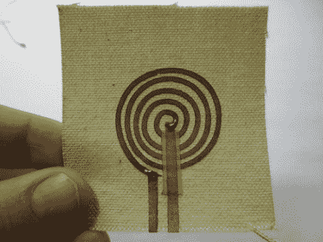

# 织物扬声器

> 原文：<https://hackaday.com/2011/02/28/fabric-speaker/>

扬声器操作背后的理论非常简单。有一个线圈连着某种隔膜和一块永久磁铁。当电信号通过线圈时，会产生磁场，磁场与永磁体的相互作用会导致振膜振动并产生声音。但我们一直认为，振动材料必须绷紧才能工作。[Hannah Perner-Wilson]用布料制作了这个扬声器，证明我们错了。它使用导电胶带作为重帆布上的线圈。永久磁铁放在桌子上，为了演示，织物就放在上面。

休息后查看视频，听听这个设备产生的声音，以及使用导电线而不是胶带的设计。这让我们想知道我们听到的是不是磁铁振动桌面的结果？让我们知道你的想法，如果你有任何关于纸背电路(在视频中 0:04 看到)驱动扬声器的信息，我们也很乐意听到。

 <https://www.youtube.com/embed/h6P8DzEG_7A?version=3&rel=1&showsearch=0&showinfo=1&iv_load_policy=1&fs=1&hl=en-US&autohide=2&wmode=transparent>

 
[谢谢莫丘斯]
 </body> </html>