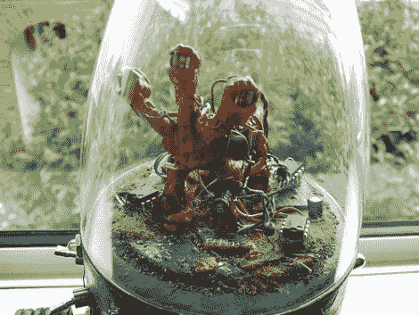

# 外星生物合成玩具

> 原文：<https://hackaday.com/2011/02/28/alien-life-form-synth-toy/>

我们收到了 Offset 博士]的最新项目，一个半雕塑/半噪音的儿童玩具，但 100%酷。该设备使用了几个 555 定时器，是他参加 [555 设计竞赛](http://hackaday.com/2011/01/25/555-design-contest-win-1500-in-prizes/)的参赛作品，该竞赛将在几天后结束。要真正享受他的创造，你需要暂时搁置怀疑，沉迷于他创造的太空幻想。换句话说，让自己再次成为一个孩子，哪怕只有几分钟。

他所建造的是一个在外太空探索任务中发现的外星生物的容器。这种生物将其有机部分与电子元件融合在一起，以便在它曾经称之为家的荒凉空旷的世界中生存。遏制单元允许你用不同的频率打击“虫子”,看看它是如何反应的。“虫子”是光敏感的，所以它总是提供不同的体验，无论白天还是晚上。

这绝对是我们见过的 555 设计竞赛中最具艺术创造力的作品之一。继续阅读，查看他的项目的完整演示。

[感谢丰富的分贝]

[https://www.youtube.com/embed/ZffdRYc8xqc?version=3&rel=1&showsearch=0&showinfo=1&iv_load_policy=1&fs=1&hl=en-US&autohide=2&wmode=transparent](https://www.youtube.com/embed/ZffdRYc8xqc?version=3&rel=1&showsearch=0&showinfo=1&iv_load_policy=1&fs=1&hl=en-US&autohide=2&wmode=transparent)