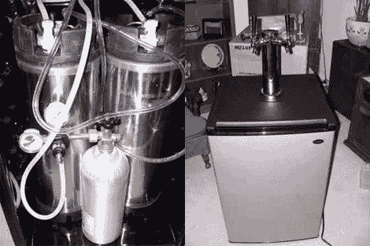

# 快速简单的 DIY Kegerator

> 原文：<https://hackaday.com/2011/02/28/quick-and-easy-diy-kegerator/>

我想我们都同意，没有什么比啤酒更适合用来黑掉一切东西了。[汤姆]把他对啤酒和建筑材料的热爱，[把它们融合在一个 DIY kegerator](http://www.kegkits.com/kegerator1.htm) 里。使用现成的迷你冰箱和一些容易找到的啤酒服务组件，他一步一步地带领我们完成转换。当一切都说好了，做好了，装啤酒的人应该装两个 5 加仑的小桶，以及装啤酒所需的二氧化碳罐。

诚然，这个过程非常简单，但这可能是从零到 kegerator 最快的方法。[Tom]这是一门科学，确切地知道什么需要改变和删除，所以如果你自己尝试这种转换，遵循他的教程应该会节省你的时间和头痛。

很高兴看到这个项目扩展到包括[精确温度控制](http://hackaday.com/2010/11/05/chest-freezer-temperature-controller/)，这是一种确定小桶里还有多少啤酒的方法。