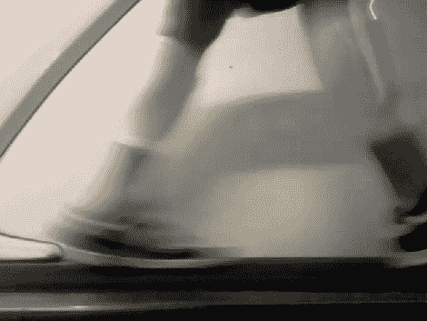

# 使用 Wii 遥控器进行行走动作分析

> 原文：<https://hackaday.com/2011/03/01/walking-motion-analysis-using-wii-remotes/>

WiiGait 不是政治丑闻，它是一个记录行走时运动数据的项目。[Bilal Chishti]和[Zassa Kavuma]在每条腿上绑上一个 Wii 遥控器，记录传感器数据，同时制作步行机的视频。两人使用 Ubuntu box 从支持蓝牙的设备中提取传感器数据，并利用其内置的网络摄像头拍摄视频。他们绘制了每个轴的数据，我们确信将数据异常与视频同步只是匹配时间戳的问题。

那么这有什么好处呢？创造者让我们对收集数据的最终目标一无所知；这可能只是为了使用硬件的体验。但我们可以看到它在让长跑运动员更有效率方面的用途，或者教会双足机器人如何平衡。

 <https://www.youtube.com/embed/sXjwyM_XWys?version=3&rel=1&showsearch=0&showinfo=1&iv_load_policy=1&fs=1&hl=en-US&autohide=2&wmode=transparent>

 </body> </html>