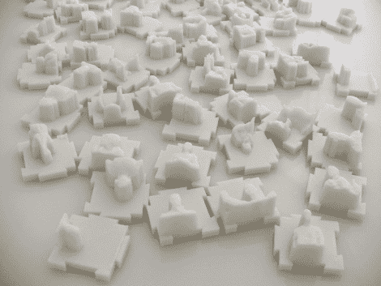

# 用 Kinect 将自己包裹在 Carbonite 中

> 原文：<https://hackaday.com/2011/02/28/encase-yourself-in-carbonite-with-kinect/>

人们围绕微软的 Kinect 创造的新的和新奇的黑客攻击似乎从未停止过。这种设备最近的用途之一来自于[互动制作]，可以让你在某种程度上制作自己。

该过程使用 Kinect 创建一个人的 3D 模型，然后显示在计算机显示器上。一旦你选择了你喜欢的姿势，一个 3D 塑料打印机就会呈现出这个图像的模型。每次扫描都会产生一个 3 厘米 x 3 厘米的塑料模型，并带有扣合在一起的燕尾接头，使模型能够组合在一起。一次全身扫描可以由三块这样的瓷砖构成，产生一个整洁的“韩·索罗被困在碳化物中”的效果。

目前只有大约 1/3 的 Kinect 全分辨率被用于创建这些模型，这对那些在家尝试的人来说是一个非常有希望的消息。理论上，如果你有一台 3D 打印机，你应该能够为自己制作更大、更详细的图像。

请继续阅读制作过程的快速视频演示。

 <https://www.youtube.com/embed/6PWaU4u5QVo?version=3&rel=1&showsearch=0&showinfo=1&iv_load_policy=1&fs=1&hl=en-US&autohide=2&wmode=transparent>

 </body> </html>