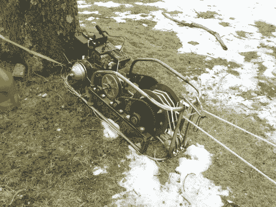

# 超级绞盘让滑雪橇 100%更有趣

> 原文：<https://hackaday.com/2011/03/01/super-winch-makes-sledding-100-more-fun/>

每个孩子都很快发现，冬天滑雪橇是很棒的，直到你不得不跋涉回到山顶。如果你的滑雪橇路程相当短，这不是问题，但是如果你在像[Josh]，[这样的大山丘上滑雪橇，你就需要想办法了。](http://cyclekarting.com/winch-project/)

他有一个卡丁车发动机，所以他认为他还不如把它作为一个雪橇绞车好好利用。绞车运行一个超过 1000 英尺的绳索连续循环，能够相当容易地将 3 个成年人拉上 30 度的斜坡。他们说，需要是创新之母，但在某些时候你必须问，“雪橇真的需要 8 马力的电机和无级变速器吗？”答案当然是响亮的“是！”

这个绞盘不仅能让[乔希]和他的朋友们迅速回到真正的雪橇运动中，它实际上让雪橇运动在两个方向上都充满了乐趣。

请继续阅读，观看绞盘运行的视频，并确保查看我们过去介绍过的绞盘的其他有趣用途。

[via Neatorama]

 <https://www.youtube.com/embed/xm4eGnL4xx4?version=3&rel=1&showsearch=0&showinfo=1&iv_load_policy=1&fs=1&hl=en-US&autohide=2&wmode=transparent>

 </body> </html>