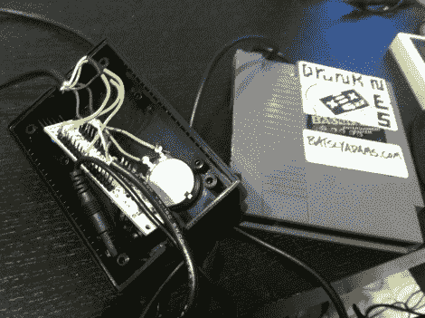

# 醉酒让喝醉变成了一场游戏

> 原文：<https://hackaday.com/2011/03/02/drunkennes-makes-a-game-out-of-getting-hammered/>

虽然手持酒精测试仪在和朋友喝酒时很新奇，但 50 美元的现成设备一点也不令人兴奋。如果你真的想抓住人们的注意力，你必须有创意，像[Batsly Adams]和他的朋友们所做的那样。

一天晚上，他正和几个朋友漫不经心地喝酒，摆弄着一个电子酒精传感器。他们很快组装了一个可以播放声音的 NES 只读存储器，根据传感器检测到的酒精含量来改变音调。他们很快意识到一款成熟的酒精测试视频游戏已经准备就绪。很快，他和他的朋友们就完成了图形、配乐和驱动他们的游戏《酒鬼》的代码。

为了玩这个游戏，每个玩家必须向一个装有酒精传感器的 NES 弹药筒吹气。任天堂计算玩家的 BAC，用简单的图形和低级的动物双关语报告他们有多陶醉。我们不知道何时会有代码和原理图，但当它们可用时，你可以保证我们会建造一个用于“研究”目的的，与我们的[动力沙漏](http://hackaday.com/2011/03/01/timed-shot-glass-wont-let-you-stop-drinking/)配对。

继续阅读，看看一些醉酒的游戏视频

[谢谢亚当]

【维梅奥 http://vimeo.com/20441801 w = 470】

 <https://www.youtube.com/embed/KYNoPeRqidY?version=3&rel=1&showsearch=0&showinfo=1&iv_load_policy=1&fs=1&hl=en-US&autohide=2&wmode=transparent>

 </body> </html>