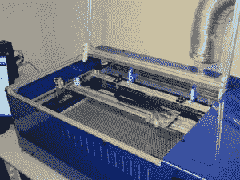

# 开源激光切割机(v2)

> 原文：<https://hackaday.com/2011/03/02/open-source-laser-cutter-v2/>

Buildlog.net 2 . x 激光是第二代[开源激光切割机](http://www.buildlog.net/blog/2011/02/buildlog-net-2-x-laser/)，它无疑改进了第一代的设计。2 轴机器(可选的垂直轴是手动的或可升级的)拥有一个 12 英寸 x 20 英寸 x 4 英寸的大工作空间，同时比其前身更小，适合桌面设计。

旧型号的目标是自我复制，这限制了使用的材料类型，新的 2.x 型号放弃了这一目标，使用了更坚固的金属部件。电子设备现在是模块化的，允许更容易和更干净的布线，尽管你仍然需要一个控制板。

在[BuildLog.net](http://www.buildlog.net/)的主页上提供了一个基于 XMOS 的控制器，以及机械图纸、原理图、gerbers、两台机器的说明和套件(第一个型号)以及激光管和电源等重型物品的资源。