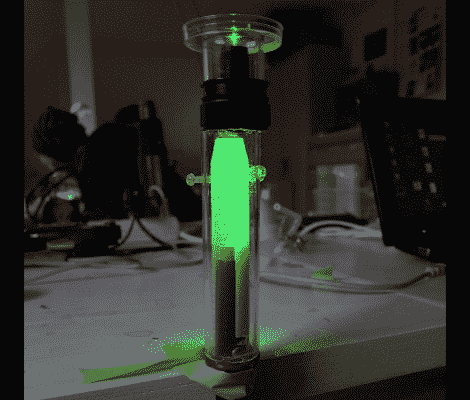

# 对激光投影显微镜的不同看法

> 原文：<https://hackaday.com/2011/03/02/a-different-take-on-a-laser-projection-microscope/>

[Dusjagr]有另一个制作激光投影显微镜的想法。去年我们看到了[一台基于激光的显微镜](http://hackaday.com/2010/08/21/laser-microscope-projection/)，它通过一个包含被放大物体的水滴发出光束。水滴使聚焦光束弯曲，并将放大的内容投射到屏幕上。这很好，Dusjagr 自己也使用了这种方法。但是大多数传统显微镜使用载玻片来容纳物体，现在这种新版本使这成为可能。

经过一点实验，Dusjagr 发现由网络摄像头改造的镜头可以达到与水滴相似的聚焦效果。休息后的视频显示了上面看到的设备在运行。激光穿过透镜，然后穿过一个载有附近池塘水样的载玻片。图像是清晰的，尽管完全沐浴在绿色之中。

对我们来说，[dus jagr]文章中最有趣的部分是他根据二极管发出的光的波长讨论激光放大的极限。

【维梅奥 http://vimeo.com/20472931 w = 470】