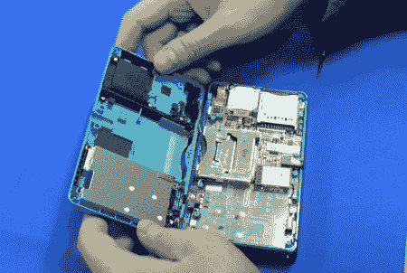

# 任天堂 3DS 拆机

> 原文：<https://hackaday.com/2011/03/03/nintendo-3ds-teardown/>

任天堂 3DS 已经上市几天了(在日本)，[tech on]的人很友好地做了一次[拆卸](http://techon.nikkeibp.co.jp/english/NEWS_EN/20110228/189942/)。除了所有常规的拆卸，你还可以用显微镜好好看看 3DS 的 3D 屏幕。原来这是一个视差栅栏显示器，这意味着在 LED 阵列的顶部有狭缝，可以在不使用特殊眼镜的情况下创建 3D 效果。其余的硬件似乎相当标准，运行基于 ARM 的处理器，带有一些 DRAM 和 NAND 闪存。显然 3DS 没有得到太多的升级(降级？)就 DRM 而言，因为在 youtube 上已经有 3DS 使用 R4 卡运行盗版游戏的例子了。

[通过[订婚者](http://www.engadget.com/2011/02/28/nintendo-3ds-gets-torn-apart-and-hacked-a-day-after-japanese-lau/)