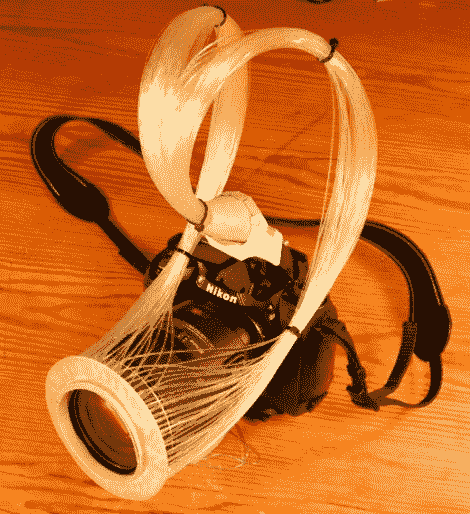

# DIY 环形灯从光纤玩具中获得灵感

> 原文：<https://hackaday.com/2011/03/03/diy-ring-light-takes-its-cues-from-fiber-optic-toys/>

DSLR 相机的 DIY 环形灯设置在这里并不新鲜。虽然他们中的大多数依赖于 led 阵列或基于镜子的灯管，但[Wolf] [有一个不同的想法](http://blog.blazingangles.net/soapbox/2011/03/diy-ring-flash-with-an-optical.html)。他认为，由于光纤是专门用来将光从一个地方传输到另一个地方的，所以它们是构建环形灯的完美媒介。

由于他使用相机内置的闪光灯为环形灯供电，他能够提供其他 DIY 环形灯很少提供的功能:适当的闪光灯补偿。通常，自制的环形灯以一个设定的亮度闪烁，而不管实际需要多少光来组成图像。

建设相对简单，虽然费时。他采购了一套光纤电缆，这些电缆被熔化成 150 个小捆，然后粘在他制作的丙烯酸环上。最终的结果并不是我们见过的最具美感的环形灯，但照片才是最重要的。正如你在他的网站上看到的，他们为自己说话。

想打造自己的环形灯吗？看看[的一对](http://hackaday.com/2010/11/09/machine-your-own-ring-light/)[情侣](http://hackaday.com/2009/11/16/led-ring-light/)其他项目我们过去有[的特色](http://hackaday.com/2009/02/06/fiber-optic-flash-ring-2/)。