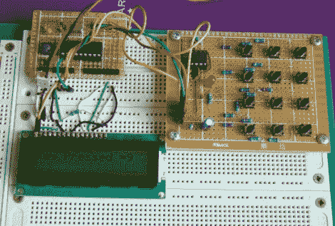

# 555 定时器扫描键盘输入

> 原文：<https://hackaday.com/2011/03/03/keypad-input-scanning-by-a-555-timer/>

[R-B]设计了一个 555 定时器电路来扫描一个键盘。键盘是小型项目的常用接口，需要微控制器进行行和列扫描。[R-B]设置允许您将微控制器上使用的引脚数量减少到两个。一个是当任何按钮被按下时触发的中断，另一个从 555 芯片读取频率。每个按钮都有自己的电阻，可以改变 555 的频率。微控制器使用定时器读取 100ms 的频率。在此期间发生的定时器溢出次数直接对应于按钮的按下次数(数字 5 溢出五次，数字 0 溢出零次)。

我们通常按下按钮 40 毫秒后去抖，这是那个时间的两倍多，但仍然不是一个惊人的差别。这让我们怀疑你是否会错过快速按键？唯一真正知道的方法是亲自尝试。休息之后，请观看视频，不要忘记留下您自己在电路工作中的经历。

 <https://www.youtube.com/embed/tQAmQgBgJAE?version=3&rel=1&showsearch=0&showinfo=1&iv_load_policy=1&fs=1&hl=en-US&autohide=2&wmode=transparent>

 </body> </html>