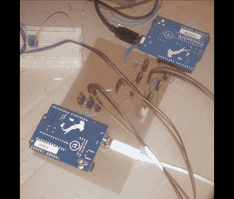

# 基于 Arduino 的环境照明改进

> 原文：<https://hackaday.com/2011/03/03/arduino-based-ambient-lighting-improvements/>

[Simon]在现有的基础上做了这个 Arduino [环境照明系统，它有四个不同的颜色区域](http://www.instructables.com/id/Java-Microcontroller-LED-TV-Ambient-Light)。他的灵感来自于我们几周前看到的[【罗伊】基于加工的装置](http://siliconrepublic.blogspot.com/2011/02/arduino-based-pc-ambient-lighting.html)。该系统使用处理来确定当前显示图像的平均颜色，然后在单个 RGB LED 条上显示该颜色。[西蒙]想得更大一点。

他购买了一个可以切割成不同部分的照明带，然后开始开发自己的多色彩区域软件。他几乎没有处理经验，所以他降低了抽象层，使用 Java 编写接口。它有很多很好的设置，你可以调整颜色显示的方式、时间和原因。最后，他在屏幕的左、右、左上和右上有四个可独立寻址的色带。最棒的是，他开发的 Java 套件可以在不同的平台上使用，已经在 Windows 和 Linux 上进行了测试。