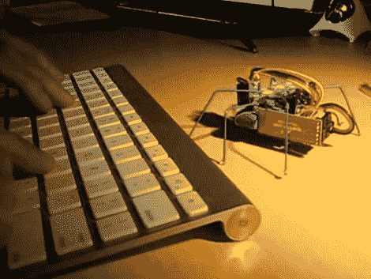

# 抖动的六足机器人会随着蓝牙键盘的敲击而起舞

> 原文：<https://hackaday.com/2011/03/03/jittering-hexapod-dances-to-the-strokes-of-your-bluetooth-keyboard/>

这是一个小巧但功能强大的[六足机器人，通过蓝牙](http://blog.sigfpe.com/2011/02/build-yourself-bluetooth-controlled-six.html)控制。[Sigfpe]从[Polulu 出售的六足套件](http://www.pololu.com/docs/0J42)开始，并添加了一个 BlueSMiRF 调制解调器，以使这个小家伙的通信启动并运行。但由于机器人仅仅是三个伺服系统、一个微控制器板、传感器和各种零件，因此对大多数电子爱好者来说很容易构建。

休息后看看视频，看看它能按照你的要求表演的令人愉快的舞蹈。当我们第一次看这个项目时，我们认为键盘是直接与机器人配对进行控制的，但看看代码，我们认为计算机在处理击键后控制它。无论哪种方式，BlueSMiRF 与其他蓝牙设备配对都没有问题，因此只需编写代码，让它从您选择的设备接收命令。我们希望看到 Android 控制，但对于真正的核心代码猴子，我们认为这应该是用蓝牙耳机进行语音控制。

 <https://www.youtube.com/embed/kO8aaN1X-lk?version=3&rel=1&showsearch=0&showinfo=1&iv_load_policy=1&fs=1&hl=en-US&autohide=2&wmode=transparent>

 </body> </html>