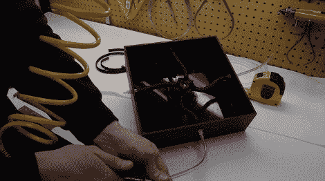

# 触觉反馈操纵杆使用空气肌肉

> 原文：<https://hackaday.com/2011/03/04/haptic-feedback-joystick-uses-air-muscles/>

本·克拉斯诺正在研究一种力反馈操纵杆。它围绕着将压力转化为线性运动的空气肌肉的概念。他引用了[的另一个空中肌肉项目](http://www.instructables.com/id/How-to-make-air-muscles!/)作为他建造的灵感的一部分，但他所做的是我们已经看到的这些放大组件的更好的用途之一。

基本上你有一个膀胱，在这种情况下，橡胶管。一个网包围着它，以加强材料，并导致膨胀，以缩短包装的长度。在上图中，有四块黑色的气肌连接着操纵杆的底座和外壳。每块肌肉受压的方式和时间决定了用户在操纵杆上感受到的运动类型。这就是他的压力控制器发挥作用的地方。它使用一个电压-压力转换器来为一个歧管供电，这两者的结合不仅使每块肌肉都可以寻址，还允许他将力度输入到肌肉中。休息之后，请观看他从头到尾的视频。

[https://www.youtube.com/embed/AkaVsoEd6Vo?version=3&rel=1&showsearch=0&showinfo=1&iv_load_policy=1&fs=1&hl=en-US&autohide=2&wmode=transparent](https://www.youtube.com/embed/AkaVsoEd6Vo?version=3&rel=1&showsearch=0&showinfo=1&iv_load_policy=1&fs=1&hl=en-US&autohide=2&wmode=transparent)