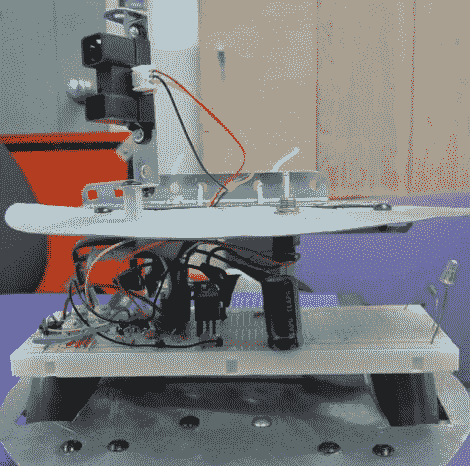

# 模拟机器人在车间轻松导航

> 原文：<https://hackaday.com/2011/03/04/analog-robot-navigates-around-the-workshop-with-ease/>

我们在这里介绍的许多机器人都是由某种微控制器驱动的，无论是 Arduino、Launchpad 还是 Picaxe 等。然而，我们很少看到机器人使用模拟电路来执行通常由更复杂的控制器完成的高级功能。Instructables 用户[hasn0life]最近制造了这样一个机器人，他在学校参加了一个竞赛。从一个朋友那里听说了 555 设计竞赛后，他调整了他的项目，用 556 定时器创造了一个沿墙机器人。

当你仔细观察时，这个机器人相当简单，尽管这并没有减损他设计的优雅。单个红外传感器用于检测机器人周围的物体，引导机器人前进。当机器人太靠近墙壁时，一个轮子反转，将机器人拉走。一旦机器人移动了足够的距离，另一个轮子就反转，以便使机器人伸直。然后，两个轮子协同工作，使机器人向前移动。

看看下面的视频，看看机器人在他的车间里导航，如果你有兴趣了解更多关于模拟机器人的知识，请查看几天前的这篇文章。

[https://www.youtube.com/embed/F3CrT_Yz1wE?version=3&rel=1&showsearch=0&showinfo=1&iv_load_policy=1&fs=1&hl=en-US&autohide=2&wmode=transparent](https://www.youtube.com/embed/F3CrT_Yz1wE?version=3&rel=1&showsearch=0&showinfo=1&iv_load_policy=1&fs=1&hl=en-US&autohide=2&wmode=transparent)