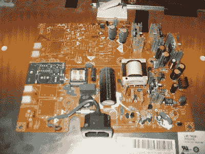

# 使用回收的 CCFL 逆变器部件进行 LED 背光转换

> 原文：<https://hackaday.com/2011/03/04/led-backlight-conversion-using-recycled-ccfl-inverter-parts/>

[Ammon]修理坏掉的 LCD 显示器是他的业余爱好，所以更换烧坏的 CCFLs 和逆变器电路是他睡觉时也能做的事情。他收到的一台戴尔显示器让他不知所措，以至于他干脆放弃了修理逆变器电路的尝试。他仍然想让它工作，所以他做了一些窄的印刷电路板，并开始研究他的 [LED 替代背光。](http://blog.allgaiershops.com/2011/03/04/its-alive/)

他为 led 制作了一个驱动板，用他从 LCD 面板的逆变器电路中拆下来的剩余元件填充。他需要空间来插入他的驱动板，所以他简单地切下一大块逆变器板，然后把替换的驱动板放在它的位置上。正如你在上面的图片中看到的，他的电路板(绿色)比它取代的原始逆变器电路占用的空间少得多。

他提供了电路原理图和 PCB 布局文件，因此复制他的工作应该相当容易。他还没有公布他的 LED 灯条的原理图或布局信息，但我们打赌如果有人友好地询问，他会的。

如果你有兴趣阅读更多关于用发光二极管替换你的烧坏的 CCFL 的信息，看看这一对[的](http://hackaday.com/2006/05/23/ccfl-backlight-replaced-with-white-leds/)帖子。