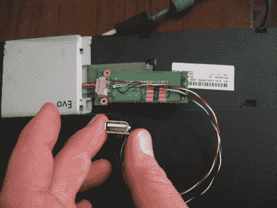

# Quick Hack 为老化的笔记本电脑带来 Wi-Fi

> 原文：<https://hackaday.com/2011/03/06/quick-hack-brings-wi-fi-to-an-aging-laptop/>

[Jarrod]有一台他仍然非常喜欢的老式康柏笔记本电脑，但是他有一个小问题——这台笔记本电脑没有内置无线网卡。他最近将家中无线网络的安全协议更改为 WPA，并意识到他的旧 Linksys PC 卡仅支持 WEP。他决定是时候寻找另一种无线连接方式了，所以他开始四处寻找选择。

事实证明，他的笔记本电脑确实有能力接受 LCD 安装的附加无线卡，但它的价格约为 100 美元，不支持 WPA。他认为卡滑入了某种美化了的 USB 端口，拆开笔记本电脑后，他发现自己是对的。

他迅速将几根电线和一个 USB 适配器焊接到已经占据卡槽的蓝牙板上，然后插入一个无线鼠标，看看会发生什么。鼠标的无线电通电没有问题，更让[Jarrod]高兴的是，端口兼容 USB 2.0。

现在他知道端口是活动的，他计划找到一个小型 USB 802.11 G 或 N 适配器来塞进插槽——随着市场上微型 USB Wi-Fi 适配器的泛滥，这应该不会太难。