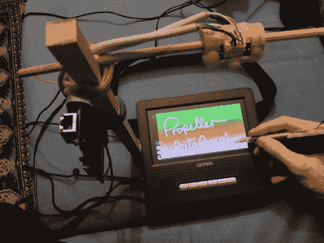

# 基于 Wiimote 的白板可以让你在任何表面上书写

> 原文：<https://hackaday.com/2011/03/07/wiimote-based-whiteboard-lets-you-write-on-any-surface/>

Wiimote 对黑客来说是一个很棒的工具，因为他们负担得起，而且很容易上手。[Gareth]在做另一个基于 Wiimote 的项目时有了一个“灵光一现”的时刻，经过一些修改，[把它变成了一个电子白板](http://letsmakerobots.com/node/25677)。

白板是用他从 Wiimote 中提取的红外传感器构建的，该传感器连接到 EasyProp 板以处理输入。Wiimote 的目标是一个 LCD 屏幕，可以使用他用红外 led 和几节电池制成的光笔来“绘制”。笔的任何移动都会被 Wiimote 的红外传感器跟踪，并转换为 XY 坐标，然后绘制在屏幕上。该传感器能够一次跟踪多达四个点，因此理论上您可以同时使用多达四支笔。

[Gareth]指出，该传感器并不局限于跟踪小型显示器，因为白板可以使用任何类型的背投设备轻松放大尺寸。

请继续阅读，观看他的白板视频。

 <https://www.youtube.com/embed/Ja71fg5zRcA?version=3&rel=1&showsearch=0&showinfo=1&iv_load_policy=1&fs=1&hl=en-US&autohide=2&wmode=transparent>

 </body> </html>