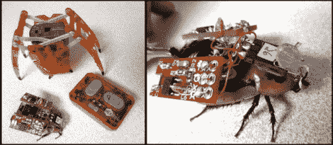

# 即将来到你附近的商店:遥控蟑螂

> 原文：<https://hackaday.com/2011/03/08/coming-soon-to-a-store-near-you-remote-control-cockroaches/>

给定一个装满蟑螂的盒子，我们大多数人会做的第一件事是试图找到最近的火源。对蟑螂来说幸运的是，后院大脑的团队看待事物的方式与我们略有不同。

他们的最新成果是将蟑螂和电子结合起来，创造出一种被称为“机器人 T1”的生物电混合体。使用从一只六角尺蠖捐赠的控制电路和大约 555 个定时器来产生正确定时的脉冲，他们已经能够控制蟑螂的大动作。刺激直接传递到蟑螂的触角神经，使它们能够告诉蟑螂转向哪个方向以及何时转向。

目前系统中有一些问题，他们正在努力解决。目前，他们用金属丝缠绕的蟑螂只有 25%能被控制。然而，一旦这一比例提高，他们将寻求提供 RoboRoach 作为测试产品。如果你的目标是增加一个甲虫空军来补充你的遥控蟑螂部队，[一定要看看这个](http://hackaday.com/2009/09/25/radio-controlled-beetle-flight-footage/)。

继续阅读，观看运行中的 RoboRoach 视频。

[https://www.youtube.com/embed/04T5Zq6KPyY?version=3&rel=1&showsearch=0&showinfo=1&iv_load_policy=1&fs=1&hl=en-US&autohide=2&wmode=transparent](https://www.youtube.com/embed/04T5Zq6KPyY?version=3&rel=1&showsearch=0&showinfo=1&iv_load_policy=1&fs=1&hl=en-US&autohide=2&wmode=transparent)