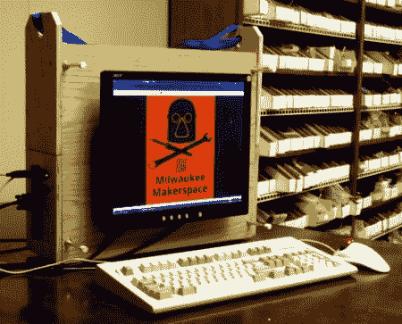

# 移动桌面

> 原文：<https://hackaday.com/2011/03/08/on-the-go-desktop/>

这里有一个你可以随身携带的台式机。它是在威斯康星州密尔沃基的一个黑客空间里建造的(加油，獾队！)使用非常基础的材料和技术。木制身体的实用结构让我们想起了[幼童军工具箱](http://www.instructables.com/id/Cub-scout-project-Wood-Tool-Box/)项目。它的顶部有一个开放的空间，可以在旅行中放置键盘和鼠标。蓝色的带子可以让你把所有 40 磅的东西都放在一个肩膀上，但我们也希望看到一个粗的销钉来配合我们脑海中的工具箱概念。

机箱的下半部分是可拆卸的，作为看起来像迷你 ITX 主板、硬盘和全尺寸电源的安装区域。正如你所看到的，液晶显示屏安装在盒子的侧面，这样你就可以将设备侧放，如果整个设备被打翻，还可以保护显示屏。[Rbean]提到他想尝试另一种使用铝而不是木材的版本，但我们喜欢这个版本。我们唯一想看到的是增加一组扬声器，安装在显示器两侧的外壳内。