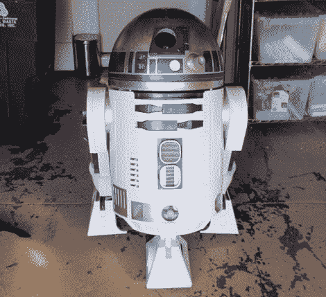

# 数控制造的 R2-D2 将童年的梦想变为现实

> 原文：<https://hackaday.com/2011/03/08/cnc-built-r2-d2-brings-childhood-dreams-to-life/>

小时候，[韦斯]一直梦想着从《星球大战》中制造一个全尺寸、功能齐全的 R2-D2 机器人。虽然大多数像这样的年轻愿望在成年人的责任和承诺中半途而废，但他没有让自己的梦想随着童年一起消失。

他开始了他的机器人制造之旅，只带着他的梦想和一些来自[R2 建造者的友好人士的帮助。整个复制品是用中密度纤维板、木材和苯乙烯板建造的，只使用了一种工具:一台数控机床。他带你走过建造的每一步，停下来就 CNC 硬件、软件等给出建议。一路上。他还为他构建的每一个部分提供了 Gcode 文件，这对任何想要构建自己的 R2-D2 克隆体的人来说都是一个巨大的帮助。](http://movies.groups.yahoo.com/group/r2builders/)

看起来他只是在着手将马达安装到他的 R2-D2 复制品的腿部外壳中，但我们迫不及待地想看看一旦他完成所有的电子设备和其他细节后会是什么样子。

如果你对更多 R2-D2 的报道感兴趣，看看这里的就知道了。