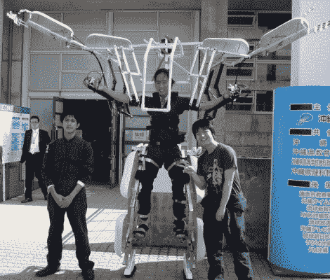

# 轻量级机器人就像打了类固醇的高跷

> 原文：<https://hackaday.com/2011/03/09/lightweight-robosuit-is-like-stilts-on-steroids/>

如果你再高一两英尺，你会怎么做？如果你的臂展是现在的两倍会怎么样？

一群日本工程专业的学生问了他们自己同样的问题，然后[制造了一个可穿戴的机箱来做这件事](http://www.dannychoo.com/post/en/26040/Skeletonics.html)。他们的项目被称为“Sukerutonikusu”，我们认为大致可以翻译为:“这太棒了，我们要两个！”。然而[Thopter]告诉我们，它被翻译成“Skeletonics”，是单词“skeleton”和“mechanics”的融合。

这套衣服由轻质铝管和薄板组成，允许它仅由穿着它的人提供动力。踩进底盘看起来像是将穿戴者抬离地面约一英尺半，同时将他们的翼展增加近 6 英尺！在下面嵌入的视频中，你可以看到穿着西装的人非常敏捷，甚至有能力以合适的速度奔跑。

如果这款产品上市，你可以打赌我们会立刻买一个——在此之前，我们将不得不满足于在办公室走动时发出机械战警的声音。

 <https://www.youtube.com/embed/IdPpWy_O09k?version=3&rel=1&showsearch=0&showinfo=1&iv_load_policy=1&fs=1&hl=en-US&autohide=2&wmode=transparent>

 </body> </html>