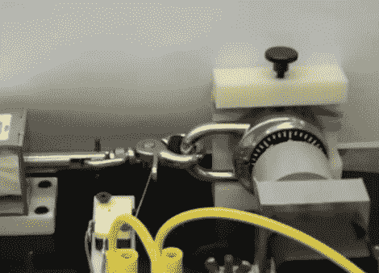

# 自动开锁使破门而入变得轻而易举

> 原文：<https://hackaday.com/2011/03/09/automatic-lock-cracker-makes-breaking-and-entering-a-breeze/>

对大多数人来说，忘记锁的密码意味着拿出断线钳，把锁切断。[奥林工程学院]的一些学生认为有一种更优雅的方式来做这项工作，所以他们建造了一台自动开锁机。

该机器由一个用来固定锁的夹子、一个用来拉开锁的螺线管和一个用来运行密码的步进电机组成。大部分处理都是在连接的计算机上完成的，使用的是他们自己开发的软件。如果您请求的话，该应用程序将会强力处理所有可能的组合，但是如果您碰巧记得的话，它也允许您输入组合的第一、第二或第三个数字。

一旦机器启动，电机开始旋转锁，螺线管猛拉插销，直到发现组合，这最多需要大约两个小时来完成。闩锁的打开使限位开关跳闸，并导致机械装置停止。一个简单的按钮按下，然后返回锁的组合给用户。

请务必查看下面嵌入的视频锁破解行动。

[通过[连线](http://www.wired.com/gadgetlab/2011/03/lock-cracking-robot-is-your-companion-in-crime/)

 <https://www.youtube.com/embed/iUilAoRzAj4?version=3&rel=1&showsearch=0&showinfo=1&iv_load_policy=1&fs=1&hl=en-US&autohide=2&wmode=transparent>

 </body> </html>