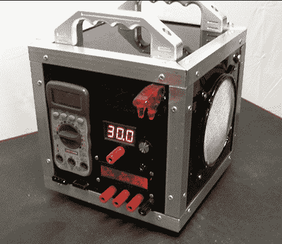

# 受 PC Casemod 启发的台式 PSU

> 原文：<https://hackaday.com/2011/03/09/pc-casemod-inspired-benchtop-psu/>

[威尔]有一个便宜的电源，他决定把它变成一个功能齐全的台式 PSU。受到我们过去展示过的其他[台式](http://hackaday.com/2010/12/09/atx-psu-turned-into-an-adjustable-voltage-bench-supply/) [耗材](http://hackaday.com/2010/10/08/bench-supply-with-current-limiting/)的启发，他决定让他的 PSU 不仅仅是放在工作台上的一个看起来很简单的盒子。从电脑机箱改装中得到一些线索，他组装了一个不仅非常有用，而且看起来非常锋利的装置。

该案件的框架是精心制作的铝角，而所有其他平面使用黑色聚碳酸酯。他安装了任何台式 PSU 都会有的标准 12v、3.3v 和 5v 端子，并配有一个 LCD 显示屏，显示由安装在机箱内的 Arduino 测量的每个轨道提供的电压。此外，他还安装了一个能够提供 1.3v-30v 电压的可变终端，以及它自己的 LCD 显示器。最独特的功能是嵌在表壳前部的万用表，这使得它几乎不可能丢失。

如果你看过他之前的作品的话，这个案子会如你所料的那样结束。它的特点是内部有 LED 照明，外壳两侧有大型风扇以实现最佳的空气流动，还有一对机械加工的铝制手柄。

请务必查看下面的 PSU 通电的快速视频。

 <https://www.youtube.com/embed/g9t3CTwdcNI?version=3&rel=1&showsearch=0&showinfo=1&iv_load_policy=1&fs=1&hl=en-US&autohide=2&wmode=transparent>

 </body> </html>