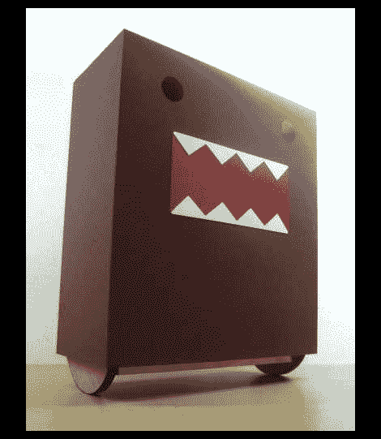

# Domo Kun 机器人无需陀螺仪即可实现平衡

> 原文：<https://hackaday.com/2011/03/10/domo-kun-robot-achieves-balance-sans-gyroscope/>

大多数自平衡机器人使用某种电路，如陀螺仪或加速度计来保持直立。然而，一些机器人可以通过简单得多的方式达到几乎相同的效果。

认识一下由[Chein]创造的 [Domo Kun wobbly bot](http://www.easterngeek.com/2011/03/domo-kun-wobblybot-simple-self.html) 。机器人本质上是一个钟摆，支点与轮轴平齐。机器人的底部装有电池、马达和重物，所有这些都使机器人在房间里快速移动时保持相对稳定。一个轻型轻木框架安装在金属底盘的顶部，一个薄纸板 Domo Kun 外壳安装在上面。这个机器人是用他从一辆玩具车上拆下来的遥控电路驱动的。他还提到，电池和重物的位置是让机器人正确平衡和滚动的关键——这需要几次尝试才能做到。

现在，如果他能编程让它自动追逐小猫…

请务必查看我们下面的测试中的机器人底盘以及最终产品的视频。

[via [HackedGadgets](http://hackedgadgets.com/2011/03/08/self-balancing-domo-robot/)

[https://www.youtube.com/embed/6Z4xyXQy96Y?version=3&rel=1&showsearch=0&showinfo=1&iv_load_policy=1&fs=1&hl=en-US&autohide=2&wmode=transparent](https://www.youtube.com/embed/6Z4xyXQy96Y?version=3&rel=1&showsearch=0&showinfo=1&iv_load_policy=1&fs=1&hl=en-US&autohide=2&wmode=transparent)

[https://www.youtube.com/embed/A0iqeKu1R2o?version=3&rel=1&showsearch=0&showinfo=1&iv_load_policy=1&fs=1&hl=en-US&autohide=2&wmode=transparent](https://www.youtube.com/embed/A0iqeKu1R2o?version=3&rel=1&showsearch=0&showinfo=1&iv_load_policy=1&fs=1&hl=en-US&autohide=2&wmode=transparent)