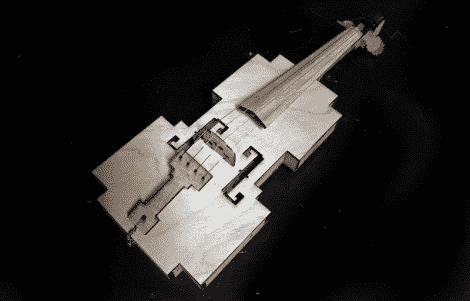

# 激光切割噪声发生器类似小提琴

> 原文：<https://hackaday.com/2011/03/10/laser-cut-noise-maker-resembles-violin/>

这看起来很像小提琴，但听起来很像有人虐待一家人的猫。[Ranjit]有了用激光切割零件制作小提琴的想法[。它并不遵循我们在弦乐器中常见的正常弯曲形状。这是因为零件都是从平板上切下来的，包括仪器的侧面。由此产生的四四方方的形状唤起了早期视频游戏对象的视觉，这就是为什么它被称为 8 位小提琴。](http://www.thingiverse.com/thing:6912)

休息之后，你可以看到一段[Bre Pettis]弹奏激光切割乐器的视频。这很糟糕，但不是那种五岁小孩第一次拿起乐器的那种。是的，最好的小提琴手花了一生的时间来磨练他们的技艺，但他们也演奏由制琴师手工雕刻的乐器，这些制琴师也花了一生的时间来完善他们的技巧。但是不要误解我们，我们认为它和 3D 打印吉他一样有趣。

[谢谢马特]