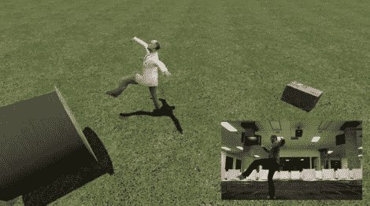

# Kinect 被黑进 Garry 的 Mod 意味着无尽的虚拟乐趣

> 原文：<https://hackaday.com/2011/03/10/kinect-hacked-to-work-with-garrys-mod-means-endless-hours-of-virtual-fun/>

[John B]是一名软件工程师，有一些空闲时间，所以他开始摆弄已经闲置了一段时间的 Kinect。他想看看如果他能够将 Kinect 数据放入支持真实世界物理的虚拟环境中，他能创造出什么。他脑海中闪现的第一个想法是将 Kinect 与 Garry 的 Mod 接口。

如果你不熟悉 Garry 的 Mod，它是一个建立在 Valve 的源引擎之上的沙盒环境。该环境支持真实世界的物理，但除此之外，它几乎可以让你做任何你想做的事情。[John]发现没有好的方法将 Kinect 数据导入软件，所以他自己开发了一个。

他使用 OpenNI 从 Kinect 收集骨骼坐标数据，然后将这些数据传递给一些自定义代码，这些代码将这些坐标打包到 UDP 数据包中。这些数据包然后被发送到一个自定义的 Lua 脚本，由 Garry 的 Mod 进行解释。

正如你在下面的视频中看到的，结果非常棒。你可以从头开始设计整个体验，而不是简单地用 Kinect 玩一些随机游戏。该项目仍处于起步阶段，但可以肯定的是，我们很快就会看到一些很酷的东西。所有的代码都可以在 github 上找到，所以试一试，和我们分享你的视频吧。

[https://www.youtube.com/embed/GBjOIjc5qn0?version=3&rel=1&showsearch=0&showinfo=1&iv_load_policy=1&fs=1&hl=en-US&autohide=2&wmode=transparent](https://www.youtube.com/embed/GBjOIjc5qn0?version=3&rel=1&showsearch=0&showinfo=1&iv_load_policy=1&fs=1&hl=en-US&autohide=2&wmode=transparent)