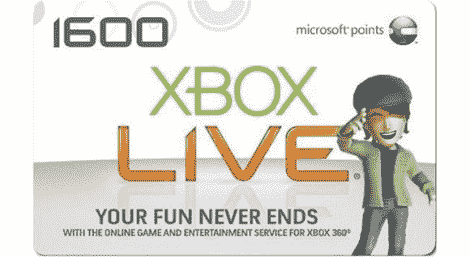

# 微软积分算法被破解…他们损失了 100 万美元

> 原文：<https://hackaday.com/2011/03/11/microsoft-points-algorithm-cracked-theyre-out-1m/>

看来[有人发现了微软使用](http://www.joystiq.com/2011/03/10/ms-point-scam-cost-microsoft-over-1-million/)为他们的替代货币生成独特代码的算法:微软点数。我们总是对做这种事情的需要感到有点困惑(迪士尼美元，游戏厅代币，等等)。)但我认为这只是一个让你花更多钱的骗局。看起来这一次它可能会回来咬他们的屁股，早期的损失预计在 100 万美元到 120 万美元之间。

但正如你们大多数人所知，不仅仅是一种算法会造成这种破坏。无论是谁想出了处理这些数字的方法，显然他把这种方法打包成了一个漂亮的图形用户界面，并在互联网上发布。休息后看看视频，它不仅会给你一个代码，而且你可以验证它在点击一个按钮时工作。微软正在采取措施使所有非法获得的兑换代码无效，但我们想知道他们能有多大效果。他们肯定已经有了应急计划，我们想知道该公司是否也有针对这种损失的保险。

尽管我们尽了最大努力，我们还是找不到关于这个话题的新闻稿。如果你知道的话，请在评论中留下链接。

[https://www.youtube.com/embed/_U7Pw4DsGdY?version=3&rel=1&showsearch=0&showinfo=1&iv_load_policy=1&fs=1&hl=en-US&autohide=2&wmode=transparent](https://www.youtube.com/embed/_U7Pw4DsGdY?version=3&rel=1&showsearch=0&showinfo=1&iv_load_policy=1&fs=1&hl=en-US&autohide=2&wmode=transparent)

[ [Reddit](http://www.reddit.com/tb/g18q6) 通过[极客](http://www.geek.com/articles/games/hackers-figure-out-ms-point-card-algorithm-and-steal-1-2-million-20110310/)