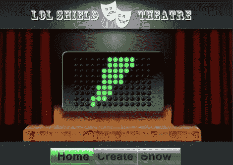

# Lol Shield Theatre 将在线视频带到像素化屏幕上

> 原文：<https://hackaday.com/2011/03/11/lol-shield-theatre-brings-online-video-to-the-pixelated-screen/>

【FallDeaf】买了一个 Lol 盾，做了各种 blinky 的展示后，心里想“这东西到底能用来干嘛？”

在硬件、软件和互联网力量的巧妙融合中，他创造了他所谓的“ [Lol Shield Theatre](http://falldeaf.com/2011/02/the-lol-shield-theatre/) ”。

这个想法是这样的:

你访问他的网站，在他的虚拟 Lol 盾上画出你自己的“电影”。添加尽可能多的帧，设置帧速率，然后提交您的创作。从那里，你可以下载一个 Arduino 草图，其中包含你的整个动画，这样你就可以在你自己的 Lol 盾上玩它了。您还可以访问他的 Lol Shield gallery，在这里您可以观看、下载和投票表决其他访问者提交的电影。

他还提供了驱动你的 Lol Shield 的源代码，并创建了一个 API，通过它你可以通过 USB 电缆将各种动画从他的 Lol Shield gallery 直接传输到你的 Arduino。

请务必查看我们在下面嵌入的视频演示，并在电影院展示您的像素电影摄影技能。

[https://www.youtube.com/embed/4l6iCcLerbs?version=3&rel=1&showsearch=0&showinfo=1&iv_load_policy=1&fs=1&hl=en-US&autohide=2&wmode=transparent](https://www.youtube.com/embed/4l6iCcLerbs?version=3&rel=1&showsearch=0&showinfo=1&iv_load_policy=1&fs=1&hl=en-US&autohide=2&wmode=transparent)